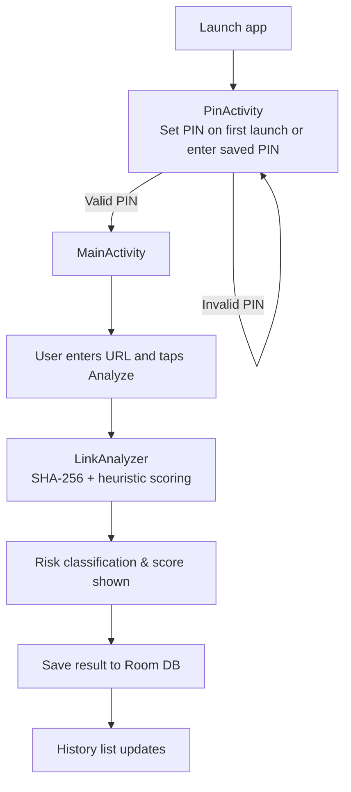

Suspicious Link Detector (Android, Java)
========================================

APK
---

- Install via USB: `adb install -r app-debug.apk`

What it does
------------
- PIN gate: first launch asks you to set a PIN; later launches require that PIN (stored in SharedPreferences).
- Analyze screen: black background, white URL box and buttons; “Analyze” runs a lightweight heuristic + SHA-256 signal.
- History: recent scans saved in Room DB with seeded example sites so the list is not empty on first run.
- Breathing/prompt screen and focus-timer style UI preserved per the reference mockups.

How to run in Android Studio
----------------------------
1) Open `SuspiciousLinkDetectorApp` in Android Studio.
2) Let Gradle sync (uses JDK 17; bundled at `.jdk/jdk-17.0.10+7/Contents/Home`).
3) Run on a device/emulator with `Run > Run 'app'` or build APK via `Build > Build Bundle(s) / APK(s) > Build APK(s)`.

How it works (flow)
-------------------

Key files
---------
- Manifest: `app/src/main/AndroidManifest.xml`
- PIN screen UI: `app/src/main/res/layout/activity_pin.xml`
- Analyze screen UI: `app/src/main/res/layout/activity_main.xml`
- History row: `app/src/main/res/layout/item_link.xml`
- Core logic: `app/src/main/java/com/example/suspiciousdetector/LinkAnalyzer.java`
- Persistence (Room): `app/src/main/java/com/example/suspiciousdetector/LinkDatabase.java`, `LinkResultDao.java`, `LinkResult.java`, `LinkResultAdapter.java`
- Lion image asset: `app/src/main/res/drawable/lion.png`
